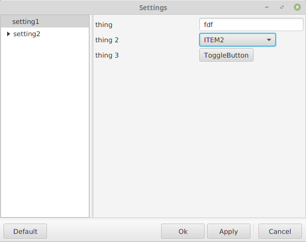
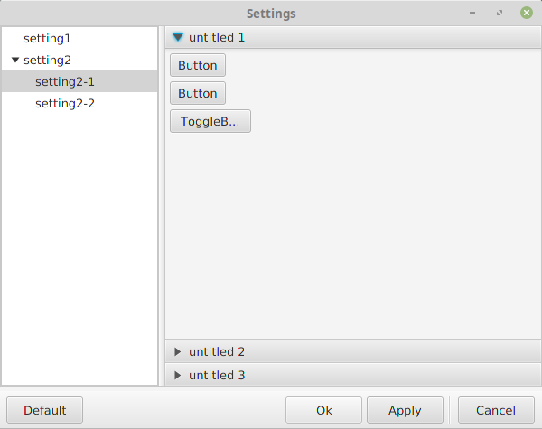

# settings-dialog


Embed a settings dialog into any JavaFX application with ease.

**NOTE: This project is still under active development and is far from completed.**

 

 

## Installation


## Quickstart
This simple example can be seen inside `stevensd.settings.examples` and visualized by running `stevensd.settings.examples.basic.BasicExample`.

```java
    // Create the controller for the settings dialog.
        
    // NOTE: ConcreteSettingsDialogController is an empty concrete implementation of SimpleSettingsDialogController.
    // For your application, subclass SimpleSettingsDialogController, NOT ConcreteSettingsDialogController.
    ConcreteSettingsDialogController<Setting> dialogController = new ConcreteSettingsDialogController<>(primaryStage, Setting.class);
    
    // Add settings by providing urls to *.fxml documents and corresponding controllers.
    Setting s1 = dialogController.createAndAdd("setting1", "/exampleSettings/setting1.fxml", new Setting1Controller());
    Setting s2 = dialogController.createAndAdd("setting2", "/exampleSettings/setting2.fxml", new Setting2Controller());
    
    // Same as above except that these are sub-settings (belong under a more general setting) so there parent setting must be provided
    dialogController.createAndAdd("setting2-1", "/exampleSettings/setting2-1.fxml", new Setting21Controller(), s2);
    dialogController.createAndAdd("setting2-2", "/exampleSettings/setting2-2.fxml", new Setting22Controller(), s2);
    
    // Show the settings pane everytime `btn` is clicked
    Scene settingsScene = new Scene(dialogController.getPane());
    Button btn = new Button("Show Settings");
    btn.setOnAction(event -> {
      Stage settingsStage = new Stage();
      dialogController.setStage(settingsStage);
      settingsStage.setScene(settingsScene);
      settingsStage.showAndWait();
    });
    
    // Create the main Pane that is visible when the application starts. (its just a button)
    AnchorPane pane = new AnchorPane();
    pane.getChildren().add(btn);

    // Create and show the settings dialog. (The DialogController knows how to load itself)
    Scene scene = new Scene(pane);
    primaryStage.setTitle("Settings");
    primaryStage.setScene(scene);
    primaryStage.show();

```

## Usage


#### Settings Panes

There are two ways to create and add setting panes to the `SettingsView` object.

##### 1. FXML document + SettingsFactory
Probably the simpler option, this method involves creating a **.fxml* document for each setting and using a 
`SettingsFactory` to load the Pane, and add it to the `SettingsView` object.

```java
    
    

```

##### 2. Manually create Setting from Pane.


#### Settings Controllers
Each setting pane will need a controller. The controller should extend `AbstractSettingController`. This provides the 
basic functionality for detecting changes in the GUI.

